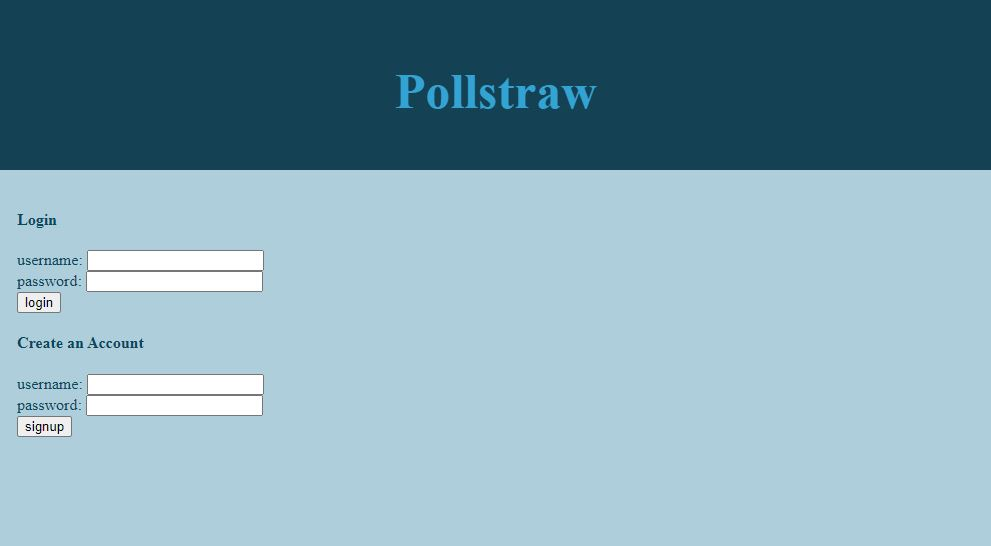

# Poll Maker


## Description

"PollStraw" is a web app that allows users to create polls and view the results using charts. With user authentication, database integration, and Chart.js, users can easily create and share polls with their friends and colleagues, while tracking the results in real-time. The app provides a clean and user-friendly interface, making it easy for anyone to create and participate in polls.

## Table of Contents
- [Installation](#installation)
- [Usage](#usage)
- [Screenshot](#screenshot)
- [Contributors](#contributors)
- [License ](#license)

## Installation

To install this application, follow these steps:

1. Clone the repository from GitHub
2. Download and install Node.js from the official website
3. Open your terminal and navigate to the root directory of the application
4. Install the required dependencies by running ```npm install```

## Usage

To use this application, please follow the steps below:

1. Open your terminal and navigate to the root directory of the application
2. Start the application by running node server.js
3. Open your preferred web browser and go to localhost:3000 (or the port you have configured)
4. Explore the available polls and cast your votes
5. View the dynamically rendered bar chart that displays the poll results
 You can also view the live application on  [Heroku](https://poll-maker.herokuapp.com/).

## Screenshot



## Dependencies

This application relies on the following dependencies:

- Express
- Handlebars
- Sequelize
- Chart.js


## Contributors

- [Harrison Counts](https://github.com/Satalae)
- [Corey Vasser](https://github.com/spamdalfz)
- [Alicia Keberle](https://github.com/keberlea)
- [Elijah Morris](https://github.com/MorrisEli)


## License 

This project is licensed under the MIT license. Click [here](https://opensource.org/licenses/MIT) for more information.